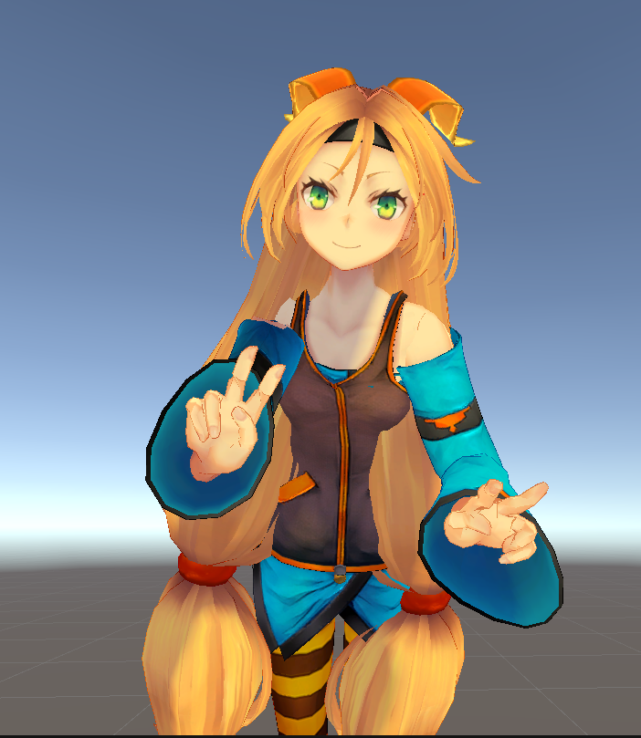

# Sign Joy Unity

This repository combines:

1. `Unity/`
   A Unity avatar project that can receive sign landmark data and play it on a 3D character.
2. `Python/`
   The original live webcam-to-Unity MediaPipe bridge.
3. `-Sign-Joy_AI/`
   A Flask web app for children that turns typed or spoken input into sign clips, landmark playback, 2D overlays, browser 3D views, and Unity playback.

This README is written for setting up the project on another laptop from scratch.

## What You Can Run

You can use the repo in 3 main ways:

### 1. Web app only

Run the Flask app and use:

- the homepage at `/`
- the Learning page at `/learn`
- the Games page at `/games`
- the embedded Unity WebGL scene already included in the repo

This is the easiest setup.

### 2. Web app + Unity desktop avatar

Run the Flask app and the Unity editor together.
The web app can stream the mapped sign sequence to the Unity avatar over UDP.

Default Unity bridge settings:

- host: `127.0.0.1`
- port: `5054`

### 3. Original webcam-to-Unity tracking

Run the older `Python/` MediaPipe script and animate the Unity avatar directly from a webcam.

## Recommended Software

For the smoothest setup on another laptop, use:

- Windows 10 or Windows 11
- Unity Hub
- Unity Editor `2021.3.22f1`
- Python `3.11.x`
- VS Code
- Google Chrome or Microsoft Edge

Why these versions:

- the Unity project is pinned to `2021.3.22f1` in [Unity/ProjectSettings/ProjectVersion.txt](Unity/ProjectSettings/ProjectVersion.txt)
- `mediapipe==0.10.21` in the web app is usually easiest on Python 3.11

## Project Layout

- [Unity](Unity) - Unity project with avatar, scripts, and WebGL build helper
- [Python](Python) - original webcam MediaPipe bridge
- [-Sign-Joy_AI](<-Sign-Joy_AI>) - Flask web app and frontend
- [README.md](README.md) - this root setup guide

Important web files:

- [-Sign-Joy_AI/web_app.py](<-Sign-Joy_AI/web_app.py>)
- [-Sign-Joy_AI/requirements.txt](<-Sign-Joy_AI/requirements.txt>)
- [-Sign-Joy_AI/web/templates/learn.html](<-Sign-Joy_AI/web/templates/learn.html>)
- [-Sign-Joy_AI/web/templates/games.html](<-Sign-Joy_AI/web/templates/games.html>)
- [-Sign-Joy_AI/web/static/styles.css](<-Sign-Joy_AI/web/static/styles.css>)
- [-Sign-Joy_AI/web/static/app.js](<-Sign-Joy_AI/web/static/app.js>)

Important Unity files:

- [Unity/Assets/Scenes/SampleScene.unity](Unity/Assets/Scenes/SampleScene.unity)
- [Unity/Assets/Scripts/DataManager.cs](Unity/Assets/Scripts/DataManager.cs)
- [Unity/Assets/Scripts/Body.cs](Unity/Assets/Scripts/Body.cs)
- [Unity/Assets/Scripts/Hand.cs](Unity/Assets/Scripts/Hand.cs)
- [Unity/Assets/Editor/SignJoyWebGLBuild.cs](Unity/Assets/Editor/SignJoyWebGLBuild.cs)

## First-Time Setup On Another Laptop

### 1. Install software

Install:

- Unity Hub
- Unity Editor `2021.3.22f1`
- Python `3.11`
- VS Code
- Chrome or Edge

When installing Python on Windows:

- enable `Add Python to PATH`

Verify:

```powershell
python --version
py --version
```

### 2. Clone the repository

```powershell
git clone https://github.com/teamcore38-droid/Sign-Joy-Unity.git
cd Sign-Joy-Unity
```

You can also download the ZIP from GitHub and extract it manually.

### 3. Open the Unity project once

1. Open Unity Hub
2. Click `Open`
3. Select the [Unity](Unity) folder
4. Wait for Unity to import the project
5. Open [Unity/Assets/Scenes/SampleScene.unity](Unity/Assets/Scenes/SampleScene.unity)

## Fastest Way To Run The Project

If you only want the app working on another laptop as quickly as possible:

1. Start the Flask app
2. Open `http://127.0.0.1:5001/learn`
3. Use the already-included Unity WebGL build in the browser

You do not need to rebuild WebGL just to run the site, because the repo already contains:

- [-Sign-Joy_AI/web/static/unity-webgl/Build](<-Sign-Joy_AI/web/static/unity-webgl/Build>)
- [-Sign-Joy_AI/web/static/unity-webgl/TemplateData](<-Sign-Joy_AI/web/static/unity-webgl/TemplateData>)

Rebuild WebGL only if you changed the Unity scene or scripts and want those changes reflected in the browser.

## Run The Flask Web App

Open a terminal in the repository root and run:

```powershell
cd ".\-Sign-Joy_AI"
py -3.11 -m venv .venv
.\.venv\Scripts\Activate.ps1
python -m pip install --upgrade pip
pip install -r requirements.txt
python web_app.py
```

If PowerShell blocks activation:

```powershell
Set-ExecutionPolicy -Scope Process -ExecutionPolicy Bypass
.\.venv\Scripts\Activate.ps1
```

The app starts at:

- `http://127.0.0.1:5001/`

Important pages:

- Homepage: `http://127.0.0.1:5001/`
- Learning page: `http://127.0.0.1:5001/learn`
- Games page: `http://127.0.0.1:5001/games`

Port details:

- default host: `127.0.0.1`
- default port: `5001`

You can change the port if needed:

```powershell
$env:WEB_APP_PORT=8000
python web_app.py
```

## Web App Requirements

The web app requirements currently come from [requirements.txt](<-Sign-Joy_AI/requirements.txt>):

- `flask`
- `opencv-python`
- `mediapipe==0.10.21`
- `googletrans==4.0.0-rc1`
- `speechrecognition`
- `legacy-cgi`

Optional:

- `pyaudio` for older Python microphone scripts
- `tensorflow` only for training/prediction-related scripts, not for normal web usage

## Run The Web App With Unity Desktop Avatar

Use this mode if you want `Play in Unity` on the Learning page.

### Step 1. Start Unity

1. Open the [Unity](Unity) project
2. Open [SampleScene.unity](Unity/Assets/Scenes/SampleScene.unity)
3. Press the Unity `Play` button

### Step 2. Start the Flask app

```powershell
cd ".\-Sign-Joy_AI"
py -3.11 -m venv .venv
.\.venv\Scripts\Activate.ps1
python -m pip install --upgrade pip
pip install -r requirements.txt
python web_app.py
```

### Step 3. Use the Learning page

Open:

- `http://127.0.0.1:5001/learn`

Then:

1. Type something like `one plus two`
2. Or use the browser microphone
3. Click `Make My Signs`
4. Click `Play in Unity`

Unity will receive landmark payloads on:

- host: `127.0.0.1`
- port: `5054`

Those defaults come from:

- [-Sign-Joy_AI/web_app.py](<-Sign-Joy_AI/web_app.py>)
- [Python/global_vars.py](Python/global_vars.py)

You can override the bridge host/port for the Flask app with environment variables:

```powershell
$env:UNITY_UDP_HOST="127.0.0.1"
$env:UNITY_UDP_PORT="5054"
python web_app.py
```

## Run The Embedded Unity WebGL Scene

This is the Unity 3D panel inside the browser on `/learn`.

Good news:

- the WebGL build is already committed in the repo
- a fresh laptop can usually run it immediately after starting the Flask app

To use it:

1. Start the Flask app
2. Open `http://127.0.0.1:5001/learn`
3. Click `Make My Signs`
4. Click `Play 3D Scene`

## Rebuild The Unity WebGL Export

Only do this if:

- you changed the Unity scene
- you changed Unity scripts that affect WebGL playback
- the embedded Unity browser scene needs to reflect your latest Unity changes

### Option A. Use the Unity menu

1. Open the `Unity/` project
2. Wait for Unity to compile
3. Open `SampleScene`
4. Click `Build > Build SignJoy WebGL`

This runs:

- [Unity/Assets/Editor/SignJoyWebGLBuild.cs](Unity/Assets/Editor/SignJoyWebGLBuild.cs)

Output folder:

- [-Sign-Joy_AI/web/static/unity-webgl](<-Sign-Joy_AI/web/static/unity-webgl>)

### Option B. Build from command line

If Unity is installed at the default Windows path:

```powershell
& "C:\Program Files\Unity\Hub\Editor\2021.3.22f1\Editor\Unity.exe" `
  -batchmode `
  -quit `
  -projectPath "C:\path\to\Sign-Joy-Unity\Unity" `
  -executeMethod SignJoyWebGLBuild.Build
```

Important:

- make sure the Unity project is not already open in another editor instance when using batch mode

## Run The Original Webcam-To-Unity Mode

This is the older non-web pipeline from the `Python/` folder.

### Step 1. Start Unity

1. Open the `Unity/` project
2. Open `SampleScene`
3. Press `Play`

### Step 2. Create a Python environment for the old script

Open a second terminal:

```powershell
cd ".\Python"
py -3.11 -m venv .venv
.\.venv\Scripts\Activate.ps1
python -m pip install --upgrade pip
pip install mediapipe==0.10.21 opencv-contrib-python
python main.py
```

This mode uses:

- host: `127.0.0.1`
- port: `5054`

from [Python/global_vars.py](Python/global_vars.py).

## How To Use The Main Features

### Homepage

- visit `/`
- explore the landing content
- open the Learning or Games pages

### Learning page

- type text such as `one plus two`
- or use browser speech recognition
- click `Make My Signs`
- then explore:
  - sign clips
  - overlay animation
  - cartoon instructor
  - embedded Unity 3D scene
  - Unity desktop streaming

### Games page

- visit `/games`
- try `Match the Sign`
- try `Memory Cards`
- try `Count and Add`

## What Must Already Exist In The Repo

These should already be present after clone/download:

- dataset video folders used by the sign mapping pipeline
- web templates and static assets
- the Unity project files
- the prebuilt Unity WebGL output

If any are missing, some parts of the app may start but will not work correctly.

## VS Code Setup

Recommended extensions:

- Python
- Pylance
- C#

For Unity C# editing:

1. Open Unity
2. Go to `Edit > Preferences > External Tools`
3. Set `External Script Editor` to `Visual Studio Code`

## Troubleshooting

### PowerShell cannot activate the virtual environment

```powershell
Set-ExecutionPolicy -Scope Process -ExecutionPolicy Bypass
.\.venv\Scripts\Activate.ps1
```

### `python` or `py` is not found

Reinstall Python and enable `Add Python to PATH`.

### `mediapipe` install fails

Use Python 3.11:

```powershell
python -m pip install --upgrade pip
pip install mediapipe==0.10.21
```

### Web app runs, but the browser page is blank or broken

Check:

- you installed the requirements from [-Sign-Joy_AI/requirements.txt](<-Sign-Joy_AI/requirements.txt>)
- you are opening `http://127.0.0.1:5001/`
- you are using Chrome or Edge

### Browser microphone does not work

Check:

- you are using Chrome or Edge
- microphone permission is allowed for `127.0.0.1`
- you refreshed the page after granting permission

### Embedded Unity 3D Scene does not appear on `/learn`

Check:

- the Flask app is running
- the folder [-Sign-Joy_AI/web/static/unity-webgl/Build](<-Sign-Joy_AI/web/static/unity-webgl/Build>) exists
- if you recently changed Unity, rebuild WebGL
- hard refresh the browser after rebuilding

### `Play in Unity` does nothing

Check:

- Unity is open
- `SampleScene` is open
- Unity is in Play mode
- the Flask app is running
- local firewall is not blocking UDP on `127.0.0.1:5054`

### Unity is open, but command-line WebGL build fails

That usually means the same Unity project is already open in another Unity editor instance.
Close that instance first, then retry the batch build.

### The old webcam mode does not move the avatar

Check:

- Unity is in Play mode
- `python main.py` from the [Python](Python) folder is running
- your webcam is available
- `HOST` and `PORT` in [Python/global_vars.py](Python/global_vars.py) still match Unity

## Notes

- the folder name `-Sign-Joy_AI` starts with `-`, so in PowerShell it is safest to `cd` using quotes:

```powershell
cd ".\-Sign-Joy_AI"
```

- the repo intentionally does not include Python virtual environments or Unity `Library/` cache for portability
- the Unity project may take some time to import on a fresh laptop the first time

## Quick Start Summary

### Web app only

```powershell
git clone https://github.com/teamcore38-droid/Sign-Joy-Unity.git
cd Sign-Joy-Unity
cd ".\-Sign-Joy_AI"
py -3.11 -m venv .venv
.\.venv\Scripts\Activate.ps1
python -m pip install --upgrade pip
pip install -r requirements.txt
python web_app.py
```

Then open:

- `http://127.0.0.1:5001/learn`

### Web app + Unity desktop

1. Open the [Unity](Unity) project
2. Open [SampleScene.unity](Unity/Assets/Scenes/SampleScene.unity)
3. Press Play in Unity
4. Start the Flask app
5. Open `http://127.0.0.1:5001/learn`
6. Click `Make My Signs`
7. Click `Play in Unity`

### Rebuild browser Unity scene after Unity changes

1. Open Unity
2. Open `SampleScene`
3. Click `Build > Build SignJoy WebGL`
4. Refresh `/learn`
